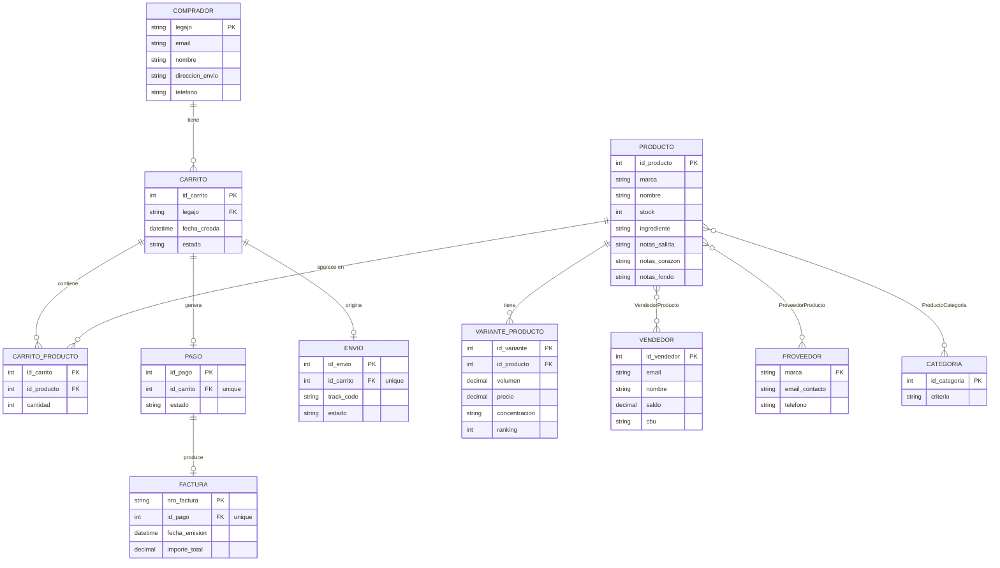
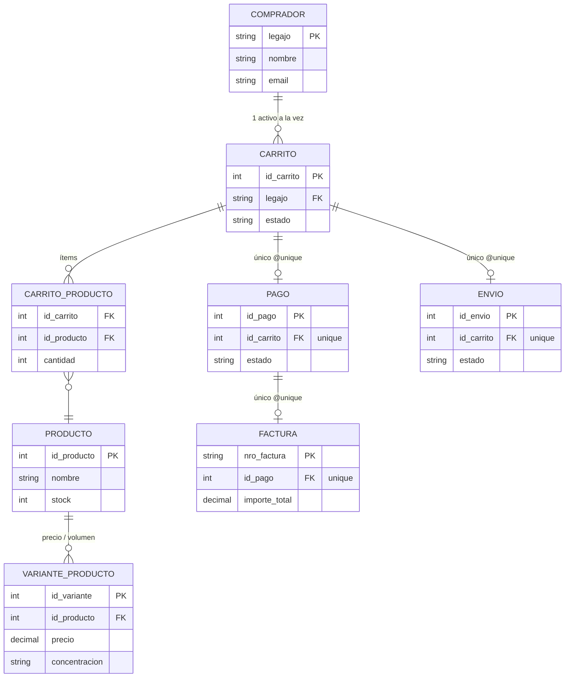
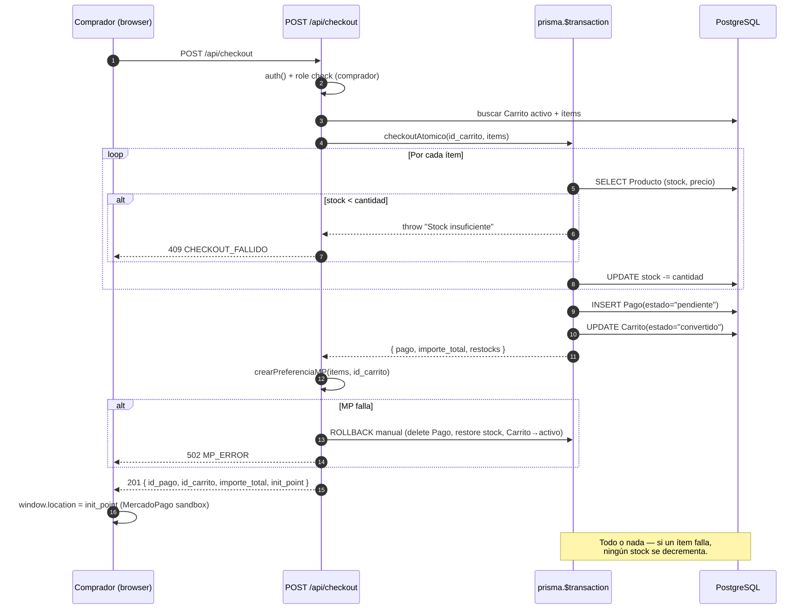
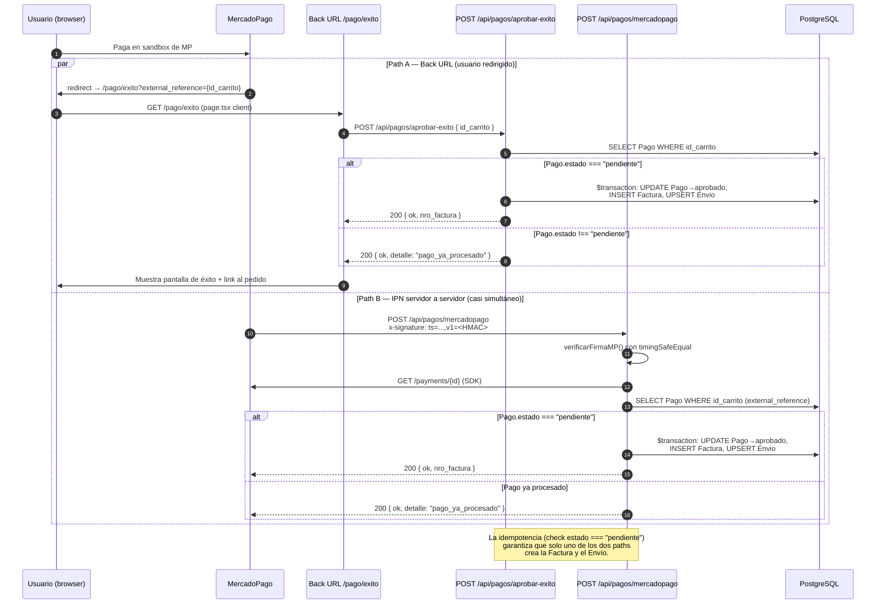
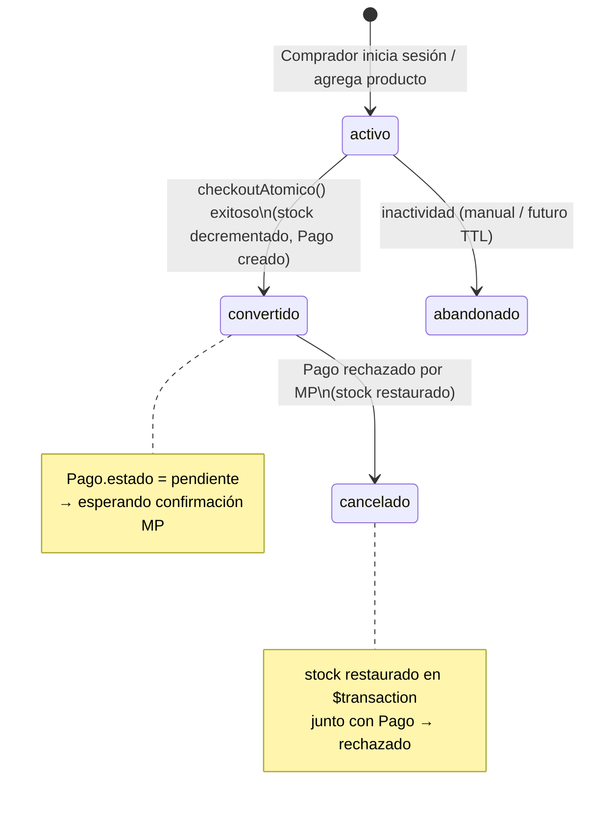
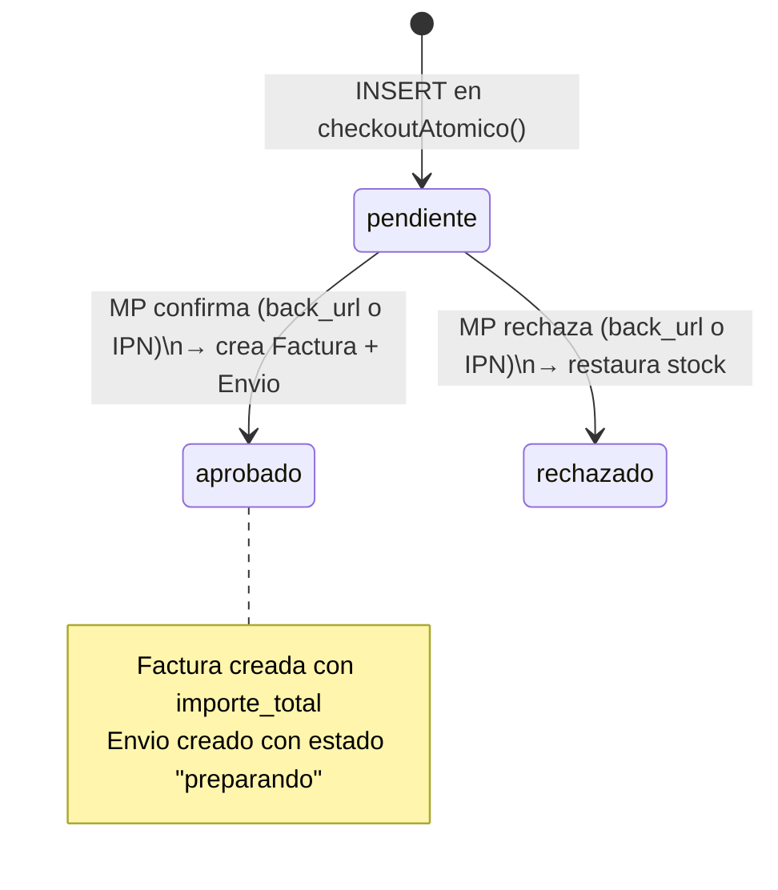
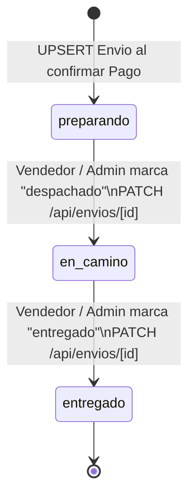
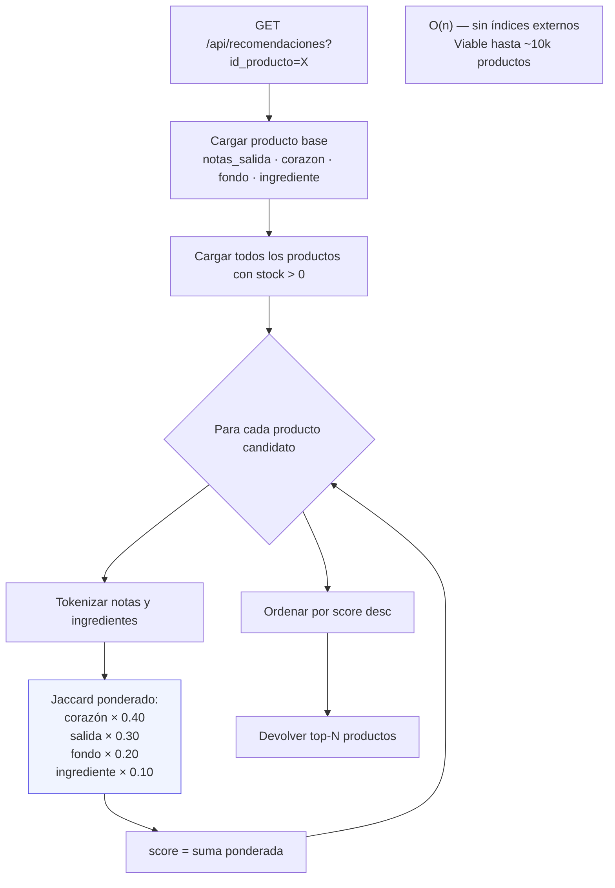

# Diagramas para la Presentación — Fragancio Elegancio
### Renderizar con la extensión "Markdown Preview Mermaid Support" en VS Code, o en GitHub

---

## 1. Modelo de Datos — Diagrama E-R completo

> **Cómo usarlo en el slide:** captura esta sección. Resaltar la cadena `Carrito → Pago → Factura` y `Carrito → Envio`.

---

## 2. Ciclo de compra — vista reducida (para el slide)

> Versión simplificada: solo las entidades del camino crítico. Ideal para el slide 5.

---

## 3. Flujo de Checkout Atómico (`lib/stock.ts`)

> Para el slide del ADR-1. Muestra que **stock, Pago y estado del Carrito** están dentro de una sola `$transaction`.

---

## 4. Flujo de Confirmación de Pago — Doble Path MercadoPago

> Para el slide del ADR-2. Muestra los **dos caminos** y cómo la **idempotencia** evita la factura duplicada.

---

## 5. Máquinas de Estado

### 5a. Estado del Carrito

### 5b. Estado del Pago

### 5c. Estado del Envío

---

## 6. Flujo del Motor de Recomendaciones (Jaccard)

> Para mencionar brevemente en el ADR-3. No es necesario ponerlo en el slide — es material de respaldo para preguntas.

---

## Notas de uso

- **VS Code**: instalar la extensión *"Markdown Preview Mermaid Support"* (Henning Dieterichs) y abrir con `Ctrl+Shift+V`.
- **Para capturar**: zoom al 100%, modo oscuro/claro según el tema del PowerPoint, `Ctrl+Shift+P` → "screenshot" o usar Snipping Tool.
- **GitHub**: sube el archivo y GitHub renderiza Mermaid directamente en el preview.
- **Exportar como PNG**: herramienta online `mermaid.live` — pegar el bloque de código y descargar SVG/PNG en alta resolución.
